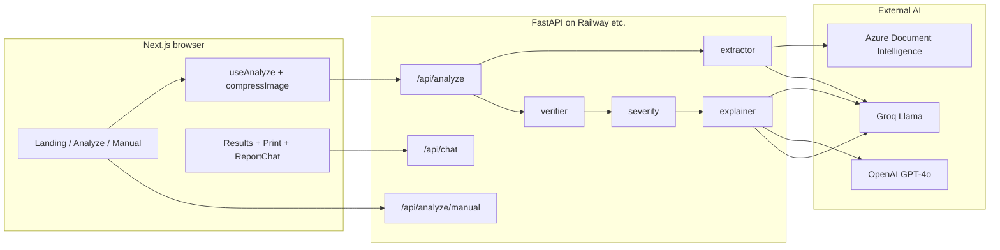

# Bodh — Project Implementation Handbook

End-to-end reference: product intent, repository layout, backend pipeline, frontend architecture, APIs, storage, UI design, deployment, and operational notes. **Last updated to match the codebase on disk** (Next.js app, FastAPI services, Groq/Azure/OpenAI integrations, print/chat flows, and visualization math).

---

## Table of contents

1. [Executive summary](#1-executive-summary)  
2. [Repository layout](#2-repository-layout)  
3. [High-level architecture](#3-high-level-architecture)  
4. [Backend](#4-backend)  
5. [Data assets & caching](#5-data-assets--caching)  
6. [Frontend](#6-frontend)  
7. [Client state & browser storage](#7-client-state--browser-storage)  
8. [HTTP API reference](#8-http-api-reference)  
9. [UI & design system](#9-ui--design-system)  
10. [Gauge & RangeBar visualization](#10-gauge--rangebar-visualization)  
11. [Security & privacy](#11-security--privacy)  
12. [Deployment](#12-deployment)  
13. [Local development](#13-local-development)  
14. [Testing & utilities](#14-testing--utilities)  
15. [Roadmap & technical debt](#15-roadmap--technical-debt)

---

## 1) Executive summary

**Bodh** is a patient-facing web app plus REST API that ingests **Indian lab reports** (PDF or image), extracts structured biomarkers, **verifies** them against lab and **ICMR** reference logic, assigns **deterministic severity**, generates **multilingual explanations** (English / Hindi / Marathi), and returns a single **`AnalysisResult`** JSON including **report summaries**, **doctor-visit question lists**, **Bodh chat starter questions**, specialist routing, and safety metadata.

**Non-goals:** Bodh does not replace a clinician; UI and prompts repeatedly steer users to professional care.

**Core pipeline:** Extract → Verify → Score → Explain → **Report summary (Groq JSON)** → API response.

---

## 2) Repository layout

```
bodh/
├── PROJECT_IMPLEMENTATION.md    ← This handbook
├── backend/
│   ├── main.py                  FastAPI app, CORS, routers, /health
│   ├── Procfile                 Railway: uvicorn on $PORT
│   ├── requirements.txt         Python dependencies for deploy
│   ├── models/
│   │   └── schemas.py           Pydantic enums & pipeline + API models
│   ├── routers/
│   │   ├── analyze.py           POST /analyze, POST /analyze/manual
│   │   └── chat.py              POST /chat (Groq, report-grounded)
│   ├── services/
│   │   ├── extractor.py         PDF/image text, PII strip, Groq JSON extraction, patient context
│   │   ├── verifier.py          Normalize names/units, ICMR/lab ranges, manual-review flags
│   │   ├── severity.py          Deterministic severity, specialist, emergency strings
│   │   └── explainer.py         Per-marker dual LLM explain; generate_report_summary (+ chat chips)
│   ├── data/
│   │   ├── icmr_ranges.json     ICMR reference data (verifier)
│   │   └── clinical_abbreviations_reference.json  Abbreviation / synonym reference (verifier & severity)
│   ├── scripts/
│   │   └── check_icmr_ranges.py Utility script for range data QA
│   ├── test_mock.py             Ad-hoc backend tests
│   └── .gitignore               venv, __pycache__, .env
└── frontend/
    ├── package.json
    ├── next.config.ts           Rewrites /api → NEXT_PUBLIC_API_URL
    ├── tsconfig.json
    ├── .env.example             NEXT_PUBLIC_API_URL sample
    ├── app/
    │   ├── layout.tsx           Root layout, fonts, suppressHydrationWarning, metadata icons
    │   ├── globals.css          Tailwind v4 entry
    │   ├── providers.tsx        AppProvider + AppShell wrapper
    │   ├── page.tsx             Home → LandingPage + navigate /analyze
    │   ├── analyze/page.tsx     Upload + manual link
    │   ├── manual/page.tsx      Typed biomarkers → API
    │   ├── results/page.tsx     Full report UI, share, print snapshot, ReportChat
    │   └── print/page.tsx       Print-optimized view; session + localStorage fallback
    ├── components/              See §6.3
    ├── context/AppContext.tsx   Global UI + result persistence
    ├── hooks/useAnalyze.ts      Multipart analyze + image compression
    └── lib/                     types, constants, apiBase, helpers, compressImage
```

---

## 3) High-level architecture



- **Browser** talks to **`NEXT_PUBLIC_API_URL`** (absolute) for JSON APIs. **`next.config.ts`** rewrites **`/api/*`** to the same base for optional same-origin use in dev.
- **File bytes** never hit the frontend LLM; extraction and summarization run **server-side**.

---

## 4) Backend

### 4.1 `main.py`

- Instantiates **`FastAPI`** with title/description/version.
- **`CORSMiddleware`**: `allow_origins=["*"]` for development and simple cross-origin deploys (tighten per environment in production if required).
- Mounts **`routers.analyze.router`** and **`routers.chat.router`** under prefix **`/api`**.
- **`GET /health`**: `{"status":"ok","service":"bodh-api"}` for probes.

### 4.2 `models/schemas.py`

| Model | Purpose |
|--------|---------|
| **`SeverityLevel`** | `NORMAL`, `WATCH`, `ACT_NOW`, `EMERGENCY`, `UNKNOWN` |
| **`RangeSource`** | `lab`, `icmr`, `unavailable` |
| **`ExtractionSource`** | `pymupdf`, `azure_di`, `manual` |
| **`ExtractedBiomarker`** | Raw extraction output |
| **`VerifiedBiomarker`** | Adds active range, `range_source`, validity, `needs_manual_review` |
| **`ScoredBiomarker`** | Adds `severity`, `deviation_score` |
| **`ExplainedBiomarker`** | Adds EN/HI/MR explanations + optional diet tips |
| **`AnalysisResult`** | API response: counters, flags, summaries, **`doctor_questions_*`**, **`chat_questions_*`**, timing, `ai_diverged`, etc. String/list fields use defaults **`""`** / **`Field(default_factory=list)`**. |
| **`PatientContext`** | Validated `age` (1–119), `gender` (`male` / `female` / `child`) |

### 4.3 `routers/analyze.py`

- **`_from_report_meta`**: Coerces Groq JSON keys into typed Python values for summaries, doctor questions, and chat starter lists (always `str` / `list[str]`).
- **`POST /analyze`**: Validates MIME (`pdf`, `jpeg`, `jpg`, `png`, `webp`), size ≤ **20 MB**, min size; builds **`PatientContext`** from form then **overrides** from **`extract_patient_context`** when extraction returns demographics.
- Flow: **`extract`** → **`verify_all`** → **`score_all`** → **`overall_severity`**, emergency message, **`recommend_specialist`** → **`explain_all(scored)`** → **`generate_report_summary(...)`** (with wall-clock `processing_time_ms` argument) → **`AnalysisResult`** with final **`processing_time_ms`** including summary call.
- **`POST /analyze/manual`**: Same pipeline from JSON **`ManualBiomarker`** rows with **`ExtractionSource.MANUAL`** and confidence `1.0`.

### 4.4 `routers/chat.py`

- **`POST /api/chat`**: Body **`ChatRequest`**: `message`, `history` (last roles capped in handler), **`report`** as **dict** (mirrors `AnalysisResult`-shaped JSON from client).
- Builds a **grounded system prompt** from **`_build_context(report)`** (patient line, specialist line, per-marker lines with explanations).
- **Groq** `llama-3.3-70b-versatile`, short answers, JSON-safe text response **`{ "reply": "..." }`**.
- Guardrails: empty message, length cap, missing **`GROQ_API_KEY`**.

### 4.5 `services/extractor.py` (conceptual; file is large)

The active **`extract()`** path (end of file) does **not** use the older PyMuPDF multi-strategy merge in the same module; it follows:

1. **Raw text**
   - **Text-layer PDF:** PyMuPDF page text joined with newlines.
   - **Scanned PDF or weak text:** Azure Document Intelligence **`prebuilt-layout`**, table rows flattened to lines (optional SHA-based cache under **`backend/.cache/azure_di/`**).
2. **`extract_patient_context(raw_text)`** — header-window regexes for **age** and **gender** (EN + HI + MR patterns, `Age/Sex`, `41 / F`, etc.).
3. **`strip_pii(raw_text)`** — line-oriented filters **before** Groq:
   - Drops lines matching metadata (e.g. collected/reported/**registered** on …) and common PII patterns (phone, email, PID, “Ref. By”, etc.).
   - **Does not** drop whole leading sections of the report (earlier implementations skipped the first *N* lines and could remove **blood indices**).
   - A generic **six-digit** pattern (intended for PIN-like codes) **does not** remove lines that match a **lab-result hint** (e.g. platelet counts like `150000`).
4. **`_call_groq(clean_text)`** — JSON-only response; **`max_tokens`** is set high so large CBC panels are not truncated mid-JSON.
5. **`_items_to_biomarkers(items, source)`** — maps Groq objects to **`ExtractedBiomarker`**; **`_clean_unit`** keeps a curated allowlist of units (Indian CBC spellings: `mill/cumm`, `cumm`, `g%`, `million/cu.mm`, `million/cumm`, etc.).

**Returns:** **`tuple[list[ExtractedBiomarker], dict]`** with **`{"age", "gender"}`** for the analyze router to merge into **`PatientContext`**.

**Operational note:** the module was built iteratively; Python binds the **last** definition of helpers such as **`strip_pii`**. After edits, restart **`uvicorn`** so the running process loads the latest code.

### 4.6 `services/verifier.py`

- Loads **`icmr_ranges.json`** and **`clinical_abbreviations_reference.json`**.
- Name normalization, LOINC/alias matching, unit harmonization (e.g. WBC/platelet scales), **three-tier** active range selection (lab → ICMR → unavailable), physiological bounds, **`needs_manual_review`** rules.

### 4.7 `services/severity.py`

- Deterministic mapping from scored markers to **`SeverityLevel`**, deviation scores, **specialist** + **urgency** heuristics, **emergency_message** templates.
- Uses clinical reference data where applicable (shared JSON path pattern with verifier).

### 4.8 `services/explainer.py`

- **`explain_one`**: Parallel **Groq** + **OpenAI** structured JSON explanations; reconciliation; **ICMR diet tip** overrides AI tips when present; timeouts and fallbacks.
- **`explain_all`**: `asyncio.gather` over markers; returns **`(list[ExplainedBiomarker], bool)`** (`ai_diverged`).
- **`generate_report_summary`**: Single **Groq** JSON object with **`summary_*`**, **`questions_*`** (doctor visit), **`chat_questions_*`** (in-app Bodh chat chips), with deterministic **fallback** object if the model fails validation.

---

## 5) Data assets & caching

| Asset | Role |
|--------|------|
| **`backend/data/icmr_ranges.json`** | Population reference ranges consumed by **`verifier`**. |
| **`backend/data/clinical_abbreviations_reference.json`** | Abbreviation / naming reference for **`verifier`** and **`severity`**. |
| **`backend/.cache/azure_di/`** (gitignored) | Optional content-addressed cache of Azure DI OCR output keyed by file hash + content type. |

---

## 6) Frontend

### 6.1 App Router pages

| Route | File | Behavior |
|--------|------|------------|
| **`/`** | `app/page.tsx` | **`LandingPage`**; CTA **`router.push('/analyze')`**. |
| **`/analyze`** | `app/analyze/page.tsx` | **`AnalyzeUpload`** + link to **`/manual`**; loading uses **`AnalyzeScannerLoader`**. |
| **`/manual`** | `app/manual/page.tsx` | Rows of biomarkers → **`POST /api/analyze/manual`**; **`Navbar`** back to analyze. |
| **`/results`** | `app/results/page.tsx` | Requires **`result`** in context or restores **`sessionStorage`** `bodh_result`; reading progress bar; zones for message, summary, priorities, full report, doctor questions, **desktop Share+Print** row; **mobile** sticky bar (**`md:hidden`**); **`ReportChat`**; WhatsApp share builds plain-text message. |
| **`/print`** | `app/print/page.tsx` | Reads **`bodh_result_print`** in **`localStorage`** (set from results before **`target="_blank"`**) then **`sessionStorage`** `bodh_result`; **`normalizeAnalysisResult`**; auto-**`window.print()`**; screen-only toolbar with **Lucide** icons. |

### 6.2 Global wiring

- **`app/layout.tsx`**: Imports **`globals.css`**; **`suppressHydrationWarning`** on **`<html>`** and **`<body>`** (browser extensions injecting attributes); **`metadata.icons`** → **`/public/brand/`** SVGs.
- **`app/providers.tsx`**: **`AppProvider`** → **`AppShell`** → **`children`**.
- **`AppShell`**: **`usePathname`**; passes **`Navbar`** `backHref` / `backLabel` on analyze vs results; wraps **`SiteFooter`**.
- **`Navbar`**: Logo link, optional **`<ChevronLeft>`** + back link, **A+** elderly toggle, EN/HI/MR pills.

### 6.3 Components (alphabetical reference)

| Component | Responsibility |
|------------|------------------|
| **`AnalyzeScannerLoader`** | Framer-motion staged “scanning” UI while **`useAnalyze`** runs. |
| **`AnalyzeUpload`** | Drop zone, camera capture, age/gender controls, Lucide icons (folder/sparkles/alert), errors. |
| **`AppShell`** | Layout chrome around pages. |
| **`BioCard`** | Collapsible marker row: **`RangeBar`**, expanded **`Gauge`** for abnormal, explanations, jargon links. |
| **`DoctorQuestions`** | **`result`**, **`lang`**, **`elderly`**; uses **`doctorQuestionsForLang`** from **`helpers`**. |
| **`FullReport`** | Severity sections of **`BioCard`** + **`JargonSheet`** host. |
| **`Gauge`** | Semicircular needle: **180°** sweep; bounds **`[low-ext, high+ext]`** with **`ext = high-low`** maps **0–100%**; arc thirds align with normal band. |
| **`JargonSheet`** | Modal definition sheet for tapped jargon terms. |
| **`LandingPage`** | Marketing sections, motion, **`Stethoscope`** / **`ChevronUp`** icons (no emoji in copy). |
| **`LangToggle`** | Small reusable language control (where used). |
| **`Logo`** | Brand mark asset wrapper. |
| **`PersonalMessage`** | Hero message + **`ScoreRing`** from severity + score. |
| **`RangeBar`** | Linear bar: green middle **33.33%–66.66%** width; dot position uses same **`ext`** math as gauge; **Framer Motion** spring. |
| **`ReportChat`** | Floating chat; **`POST /api/chat`**; history cap; suggested chips from **`chatQuestionsForLang`**; report payload built from **`result`**. |
| **`ScoreRing`** | Circular score visualization. |
| **`SiteFooter`** | Footer links/copy. |
| **`SummaryCard`** | Summary text (AI fields preferred), TTS, copy, WhatsApp share (plain text). |
| **`TopPriorityCards`** | Top abnormal markers; expandable **`Gauge`** + explanation. |

### 6.4 `lib/` modules

| File | Contents |
|------|-----------|
| **`types.ts`** | **`Lang`**, **`Severity`**, **`Biomarker`**, **`AnalysisResult`** (includes **`chat_questions_*`**). |
| **`apiBase.ts`** | **`getPublicApiBase()`** — normalizes **`NEXT_PUBLIC_API_URL`** (prepends **`https://`** when the env is host-only) for browser `fetch`. |
| **`constants.ts`** | **`SEV`** (colors, labels HI/MR, page tints, badges, personal messages), **`BODH_PRINT_SNAPSHOT_KEY`**, jargon map, loader stages/tips. |
| **`helpers.ts`** | **`cleanName`**, **`fmtVal`**, **`sevLabel`**, **`explanationFor`**, **`normalizeAnalysisResult`**, **`doctorQuestionsForLang`**, **`chatQuestionsForLang`**, **`calcScore`**. |
| **`compressImage.ts`** | **`maybeCompressImageForUpload`**: downscale + JPEG for large **`image/*`** before upload. |

### 6.5 `hooks/useAnalyze.ts`

- Builds **`FormData`** with compressed file, age, gender; **`fetch(`${API_BASE}/api/analyze`)`** where **`API_BASE`** is exported from **`lib/constants.ts`** (it calls **`getPublicApiBase()`** from **`lib/apiBase.ts`**); **`normalizeAnalysisResult`**; **`setResult`**; navigates **`/results`**.

---

## 7) Client state & browser storage

| Key | Storage | Writer | Reader |
|-----|---------|--------|--------|
| **`bodh_result`** | `sessionStorage` | **`AppContext.handleSetResult`** | **`results` page** restore; **`print`** same-tab fallback |
| **`bodh_result_print`** | `localStorage` | **`results` page** `stagePrintSnapshot` on Print link click | **`/print`** first (new tab has empty `sessionStorage`) |
| **`BODH_PRINT_SNAPSHOT_KEY`** | constant in **`constants.ts`** | value = **`"bodh_result_print"`** | |

---

## 8) HTTP API reference

| Method | Path | Description |
|--------|------|---------------|
| **GET** | **`/health`** | Liveness JSON. |
| **POST** | **`/api/analyze`** | `multipart/form-data`: **`file`**, **`age`**, **`gender`** → **`AnalysisResult`**. |
| **POST** | **`/api/analyze/manual`** | JSON body with **`biomarkers[]`**, **`age`**, **`gender`**. |
| **POST** | **`/api/chat`** | JSON **`{ message, history[], report }`** → **`{ reply }`**. |

---

## 9) UI & design system

- **Primary brand green** `#0D6B5E` (buttons, accents, print toolbar).
- **Severity palette** centralized in **`SEV`** (`constants.ts`): emerald / amber / rose / violet for NORMAL / WATCH / ACT_NOW / EMERGENCY; page background tints **`pageTint`** per severity on results.
- **Typography**: Georgia for headings / brand; system stack for UI body (**`globals.css`** + Tailwind).
- **Motion**: **Framer Motion** on landing, upload, loaders, **`RangeBar`** marker.
- **Icons**: **Lucide React** (no emoji in production UI strings for share/labels where replaced).
- **Accessibility**: `aria-hidden` on decorative icons; `suppressHydrationWarning` for extension-induced attribute mismatches.

---

## 10) Gauge & RangeBar visualization

Both use the **same numeric model**:

- Let **`lo`**, **`hi`** be active reference bounds.
- **`ext = hi - lo`** (or **`1`** if degenerate).
- **`minBound = lo - ext`**, **`maxBound = hi + ext`** so the **clinical normal band** occupies the **middle third** of the linear scale (**33.33%–66.66%**).
- **`pct = clamp((value - minBound) / (maxBound - minBound) * 100)`** (Gauge **0–100**; RangeBar dot additionally clamped **2–98** for padding).

**Gauge:** Needle angle **`-90 + (pct/100)*180`** degrees (semicircle only). Colored arc segments in SVG match the third boundaries.

**RangeBar:** Green **`div`** at **`left: 33.33%; width: 33.33%`**; marker **`left: pct%`**.

---

## 11) Security & privacy

- **PII stripping** before extraction LLM; patient demographics heuristics run on raw text pre-strip where applicable.
- **Severity & routing** are **rule-based**, not LLM-decided.
- **Chat** is **report-grounded**; system prompt refuses off-report medical advice.
- **CORS** permissive by default—restrict in hardened deployments.
- **Secrets**: never commit **`.env`**; use platform env vars in production.

---

## 12) Deployment

### 12.1 Backend (e.g. Railway)

- Set service **root** to **`backend/`** (or run command from repo root with `cd backend`).
- **`requirements.txt`**: pinned dependency ranges for FastAPI, uvicorn, pydantic, multipart, dotenv, pymupdf, Azure DI client, groq, openai, httpx.
- **`Procfile`**: **`web: uvicorn main:app --host 0.0.0.0 --port ${PORT:-8000}`**.
- Environment: **`GROQ_API_KEY`**, **`OPENAI_API_KEY`**, **`AZURE_DI_ENDPOINT`**, **`AZURE_DI_KEY`**.

### 12.2 Frontend (e.g. Vercel)

- Project root **`frontend/`** (or monorepo subpath).
- **`NEXT_PUBLIC_API_URL`**: public HTTPS URL of the API **without** trailing slash.
- **`next.config.ts`**: rewrites **`/api/:path*`** → **`${NEXT_PUBLIC_API_URL}/api/:path*`**. The rewrite target is **normalized** (bare host gets **`https://`**) so Vercel builds do not fail with “Invalid rewrite destination.”

### 12.3 `frontend/.env.example`

Documents **`NEXT_PUBLIC_API_URL`** for copy-paste onboarding.

---

## 13) Local development

```bash
# Terminal 1 — API (from backend/)
pip install -r requirements.txt
uvicorn main:app --reload --port 8000

# Terminal 2 — Web (from frontend/)
npm install
npm run dev
```

Ensure **`frontend/.env`** or shell exports **`NEXT_PUBLIC_API_URL=http://localhost:8000`** when testing against local API.

---

## 14) Testing & utilities

- **`backend/test_mock.py`**: Lightweight manual / mock checks (not a full CI suite).
- **`backend/scripts/check_icmr_ranges.py`**: Maintenance script for **`icmr_ranges`** data validation.

---

## 15) Roadmap & technical debt

- **`extractor.py`** was iteratively developed; Python binds the **last** definition of each function at import time. Restart **`uvicorn`** after edits so the running process picks up changes.
- **Automated tests** for verifier edge cases, severity transitions, explainer JSON contracts, and API integration.
- **Structured logging** + request correlation IDs for production.
- **CORS allowlist** instead of `*` when front domain is fixed.
- **Chat** payload could include explicit **`age`/`gender`** from client context for better grounding (currently may use defaults in **`ReportChat`** payload builder—align with **`useApp`** when improving).

---

*This document is the single source of truth for engineers onboarding to Bodh. Update it whenever you change pipeline contracts, env vars, or route structure.*
