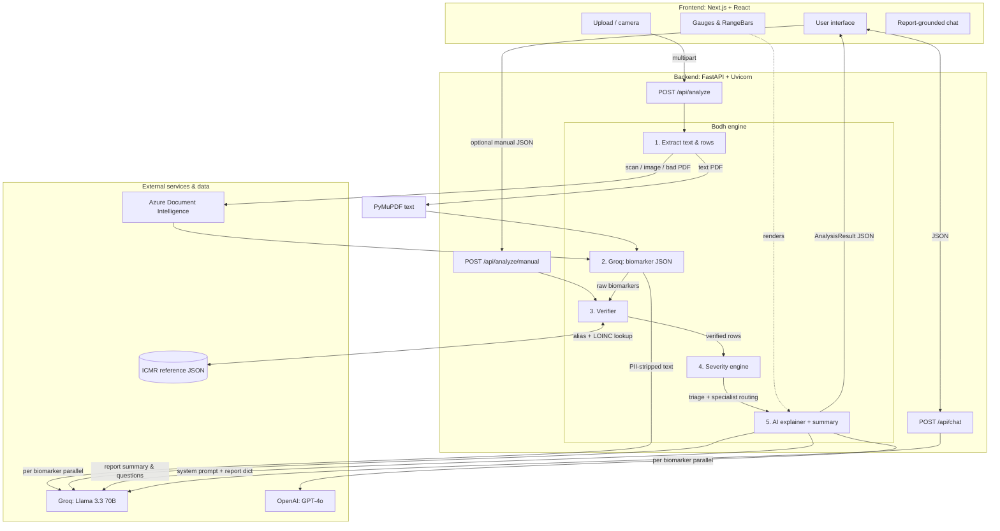

# Bodh: System Architecture & Engineering

> **Apni report, apni bhasha, apna faisla.**  
> Bodh converts complex Indian medical lab reports into verified, plain-language health summaries with deterministic triage and multilingual explanations.

---

## 1. Executive Summary

Bodh is a patient-facing web platform that processes unstructured medical lab reports (PDFs or photos) and turns them into actionable, easy-to-read insights.

**Core engineering philosophy: safety over speculation.**  
Bodh does **not** use AI to diagnose or to compute severity. It uses deterministic rules and ICMR-backed reference data (`icmr_ranges.json`) to verify and score labs. AI is used for **structured extraction from OCR text**, **multilingual explanations** that must follow the pre-computed severity, and **report-grounded chat**—always after verification.

**Not a medical device:** outputs are for health literacy only; users must consult a clinician for decisions.

**Canonical architecture (diagrams, APIs, module map):** [architecture.md](./architecture.md).  
**Design system and UX (typography, severity tokens, components):** [design.md](./design.md).  
**Prototype scope and demo script:** [prototype.md](./prototype.md).

---

## 2. High-level architecture

Decoupled **Next.js** frontend and **FastAPI** backend so files and model calls stay off the patient’s device except in transit.

**Manual path:** if OCR fails or the user prefers typing values, **`/api/analyze/manual`** skips extraction and starts at verification—same scoring and explanation pipeline.

---

## 3. Processing pipeline (upload → `AnalysisResult`)

### Stage A — Extraction (“eyes”)

- **Text-based PDFs:** raw text via **PyMuPDF**.
- **Scanned PDFs and images (JPEG/PNG/WebP):** layout OCR via **Azure Document Intelligence** (with a local disk cache under `backend/.cache/azure_di` during development).
- **Structured rows:** cleaned text is passed to **Groq (Llama 3.3)** with a strict JSON schema so names, values, units, and printed lab reference ranges become `ExtractedBiomarker` rows.
- **PII hygiene:** `strip_pii()` removes common identity/contact/header lines **before** any LLM call in this path.

### Stage B — Verification (“brain”)

- **Normalization:** raw strings (e.g. “Hb”, “Hemoglobin”) map to canonical ICMR keys; **optional LOINC** codes come from the ICMR catalog when present.
- **Active reference range (priority):**
  1. **Lab-printed** low/high from the report when extraction captured them (**highest priority**).
  2. Else **ICMR** age/gender bands from `backend/data/icmr_ranges.json`.
- **Physiological sanity:** separate bounds per analyte catch impossible values (unit/OCR mistakes); invalid rows are flagged for manual review (`needs_manual_review`).

### Stage C — Scoring (“rules”)

- **No LLM:** Python assigns **`NORMAL` · `WATCH` · `ACT_NOW` · `EMERGENCY`** plus **`UNKNOWN`** when no usable range exists.
- **Routing:** deterministic specialist recommendation and urgency copy from the scored set.

### Stage D — Explanation (“voice”)

- **Per biomarker:** `asyncio.gather` runs **Groq Llama 3.3** and **OpenAI GPT-4o** in parallel on the **same** verified JSON; outputs are reconciled; `ai_diverged` flags meaningful disagreement.
- **Report level:** `generate_report_summary` uses **Groq** (single JSON) for English / Hindi / Marathi summaries, three **doctor-visit** questions, and three **in-app chat** starter questions per language.
- **Diet tips:** ICMR-grounded tips can override model tips for Indian-context specificity.

### Stage E — Chat (`/api/chat`)

- **Groq only** (`llama-3.3-70b-versatile`): the handler builds a system prompt from the **full `AnalysisResult` dict** (biomarkers, severity, specialist, emergency note). No OpenAI on this route today.

---

## 4. Tech stack

| Layer | Technology | Role |
| :--- | :--- | :--- |
| **Frontend** | **Next.js 16**, **React 19**, **TypeScript** | App Router, client components for interactive UI |
| **Styling** | **Tailwind CSS v4** (`@tailwindcss/postcss`) | Layout and tokens |
| **UI / motion** | **Framer Motion**, **Lucide React** | Animations and icons |
| **Charts / layout** | **Recharts**, **Radix Tabs**, **html2canvas** | Optional charts, tabs, capture flows |
| **Installable** | **`manifest.json`** (`display: standalone`) | Lightweight PWA-style install |
| **Backend** | **FastAPI**, **Uvicorn** | Async API; routers under `/api` |
| **OCR** | **Azure AI Document Intelligence** | Tables and messy Indian lab layouts |
| **LLM** | **Groq** (Llama 3.3 70B), **OpenAI** (GPT-4o) | Extraction JSON, explanations, summary, chat |

---

## 5. Key engineering features

### Mathematical gauges and range bars

`Gauge` and `RangeBar` share one mapping: `ext = high - low` (or `1` if degenerate), visual domain `[low - ext, high + ext]`. The **normal band** is drawn in the **middle third** (~33.3%–66.7%) so “slightly off” vs “far off” is visually obvious; the gauge needle spans **180°**.

### Privacy and retention

- **No patient database** in the product path: analysis is request-scoped on the server.
- **Browser:** primary result lives in **`sessionStorage`** (`bodh_result`) for in-app navigation; opening **`/print`** in a new tab uses a short-lived **`localStorage`** snapshot (`bodh_result_print` / `BODH_PRINT_SNAPSHOT_KEY`) because `sessionStorage` does not carry across tabs.

### Report-grounded chat

`ReportChat` sends the verified snapshot plus recent turns to **`/api/chat`**. System rules forbid diagnosis, prescriptions, and off-report speculation; replies mirror the user’s language (English / Hindi / Marathi).

### Observability & safety flags

- **`flagged_for_review`**, **`unknown_biomarkers`**, **`recognized_biomarkers`**: coverage transparency on every `AnalysisResult`.
- Backend requires **`GROQ_API_KEY`** and **`OPENAI_API_KEY`** for the explainer module at import time; chat additionally needs Groq at runtime.

---

## 6. Repository map (quick)

| Path | Purpose |
| :--- | :--- |
| `backend/main.py` | App, CORS, `/health`, mounts `/api` routers |
| `backend/routers/analyze.py` | `/api/analyze`, `/api/analyze/manual` orchestration |
| `backend/routers/chat.py` | `/api/chat` |
| `backend/services/extractor.py` | PDF/image pipeline, PII strip, Groq extraction |
| `backend/services/verifier.py` | ICMR lookup, ranges, physiological checks |
| `backend/services/severity.py` | Deterministic severity + specialist routing |
| `backend/services/explainer.py` | Parallel Groq + GPT-4o; Groq report summary |
| `backend/data/icmr_ranges.json` | Canonical ranges and aliases |
| `backend/data/clinical_abbreviations_reference.json` | Supporting clinical abbreviation data |
| `frontend/app/*` | Routes: home, analyze, results, manual, print |
| `frontend/components/*` | UI including `ReportChat`, `Gauge`, `RangeBar` |
| `PROJECT_IMPLEMENTATION.md` | Long-form implementation handbook |

---

## 7. Local development

- **Backend:** from `backend/`, install deps, set env vars (`GROQ_API_KEY`, `OPENAI_API_KEY`, Azure keys if using OCR), run `uvicorn main:app --reload --port 8000`.
- **Frontend:** from `frontend/`, set `NEXT_PUBLIC_API_URL` to the API base; `npm run dev`.

For full deployment notes and API tables, see **`PROJECT_IMPLEMENTATION.md`**.
