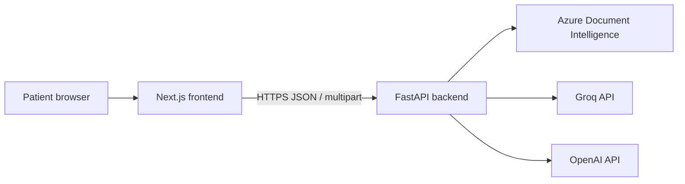
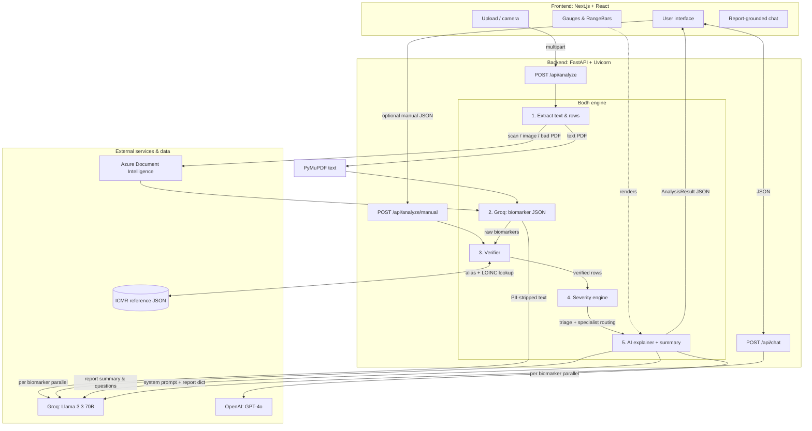
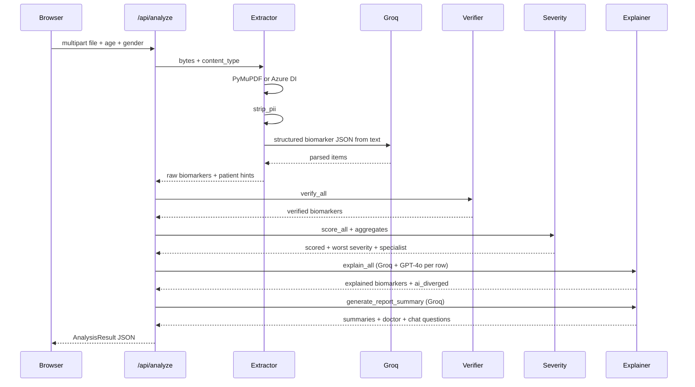

# Bodh — system architecture

This document is the **canonical** architecture reference for contributors, security review, and demos. Product overview and onboarding stay in [README.md](./README.md); implementation detail, deployment, and file-by-file notes live in [PROJECT_IMPLEMENTATION.md](./PROJECT_IMPLEMENTATION.md).

---

## 1. Goals and constraints

| Goal | Approach |
| :--- | :--- |
| Understand Indian lab reports in plain language | OCR + structured extraction, then verified ranges and templated severity |
| Safety | Severity and ranges are **deterministic**; LLMs only narrate fixed JSON and chat within report context |
| Multilingual | English, Hindi, Marathi for explanations, summaries, and chat |
| Privacy-by-design | No app database for reports; browser uses `sessionStorage` / scoped `localStorage` for print |

**Non-goals:** diagnosis, prescribing, or replacing a clinician. Bodh is health literacy tooling, not a medical device.

---

## 2. System context

- **Frontend** talks only to the configured API base (`NEXT_PUBLIC_API_URL`); production often uses a reverse proxy or Next rewrites.
- **Backend** holds secrets (`GROQ_API_KEY`, `OPENAI_API_KEY`, Azure credentials); the browser never sees them.

---

## 3. Containers and responsibilities

| Container | Runtime | Responsibility |
| :--- | :--- | :--- |
| **Web UI** | Next.js 16 (React 19) | Upload, manual entry, results, print, `ReportChat`, gauges |
| **API** | FastAPI + Uvicorn | `/api/analyze`, `/api/analyze/manual`, `/api/chat`, `/health` |
| **Azure DI** | Managed service | Layout OCR for scans and images |
| **Groq** | Managed API | Biomarker JSON from text; per-biomarker explanations (parallel with GPT-4o); report summary JSON; chat replies |
| **OpenAI** | Managed API | GPT-4o per-biomarker explanations only (parallel with Groq); reconciled with Groq output |

---

## 4. Logical architecture (components)

**Manual path:** `POST /api/analyze/manual` skips OCR and Groq extraction; the router builds `ExtractedBiomarker` rows from the client and runs **verify → score → explain → summary** unchanged.

---

## 5. Request lifecycle (happy path)

Chat (`POST /api/chat`) is a separate short-lived call: system prompt includes serialized report; **Groq only**; last eight turns capped.

---

## 6. Pipeline stages (upload → `AnalysisResult`)

### Stage A — Extraction

- **Text PDFs:** PyMuPDF text extraction.
- **Scans / images / weak PDFs:** Azure Document Intelligence; responses may be cached under `backend/.cache/azure_di` in development.
- **Groq:** converts PII-stripped text into structured rows (name, value, unit, lab ref, flags).
- **`strip_pii`:** line-oriented regex filters before the extraction LLM call.

### Stage B — Verification

- Alias table + optional **LOINC** from `icmr_ranges.json` entries.
- **Active range:** lab-printed ref if present; else ICMR age/gender band.
- **Physiological bounds:** mark impossible values and `needs_manual_review`.

### Stage C — Scoring

- Pure Python: `NORMAL`, `WATCH`, `ACT_NOW`, `EMERGENCY`, `UNKNOWN`.
- Specialist and urgency strings derived from the scored set.

### Stage D — Explanation

- **Per biomarker:** `asyncio.gather(Groq, GPT-4o)` → reconcile → `ai_diverged` if outputs disagree materially.
- **Report:** Groq-only JSON for `report_summary_*`, `doctor_questions_*`, `chat_questions_*` in three languages.

### Stage E — Chat

- Groq `llama-3.3-70b-versatile`; strict system rules (no diagnosis, no off-report answers).

---

## 7. Primary HTTP API

| Method | Path | Body | Response |
| :--- | :--- | :--- | :--- |
| GET | `/health` | — | `{ status, service }` |
| POST | `/api/analyze` | `multipart/form-data`: `file`, `age`, `gender` | `AnalysisResult` |
| POST | `/api/analyze/manual` | JSON manual biomarkers + context | `AnalysisResult` |
| POST | `/api/chat` | JSON: `message`, `history`, `report` | `{ reply }` |

Routers are mounted with prefix `/api` in `backend/main.py`.

---

## 8. Key data artifact: `AnalysisResult`

The API returns a single Pydantic model (serialized as JSON) containing:

- Identity: `report_id`, `processing_time_ms`
- Clinical core: `biomarkers[]` (verified fields + explanations + diet tips)
- Rollups: `overall_severity`, `specialist_recommendation`, `urgency_timeline`, `emergency_message`
- Trust signals: `flagged_for_review`, `recognized_biomarkers`, `unknown_biomarkers`, `ai_diverged`
- Narrative: `report_summary_{en,hi,mr}`, `doctor_questions_*`, `chat_questions_*`

The frontend stores this in **`sessionStorage`** (`bodh_result`). **`/print`** reads a one-shot copy from **`localStorage`** (`bodh_result_print` / `BODH_PRINT_SNAPSHOT_KEY`) when opened in a new tab.

---

## 9. Frontend architecture (concise)

| Area | Location | Notes |
| :--- | :--- | :--- |
| Routes | `frontend/app/*` | Home, analyze flow, results, manual entry, print |
| Shared UI | `frontend/components/*` | `Gauge`, `RangeBar`, `ReportChat`, shell, cards |
| Types / helpers | `frontend/lib/*` | Aligns with backend field names |
| Config | `frontend/next.config.ts` | Rewrites/proxy to API when used |

**Visualization math:** `ext = high - low` (min 1); scale is `[low - ext, high + ext]`; normal band occupies the **middle third**; gauge needle **180°**.

---

## 10. Backend module map

| Module | Role |
| :--- | :--- |
| `backend/main.py` | FastAPI app, CORS, router mount |
| `backend/routers/analyze.py` | Orchestrates extract → verify → score → explain → summary |
| `backend/routers/chat.py` | Report-grounded Groq chat |
| `backend/services/extractor.py` | PDF/image text, PII, Groq extraction, patient hints |
| `backend/services/verifier.py` | ICMR normalization, ranges, physiology flags |
| `backend/services/severity.py` | Severity + specialist logic |
| `backend/services/explainer.py` | Dual-model explain, Groq summary |
| `backend/models/schemas.py` | Pydantic types and enums |
| `backend/data/icmr_ranges.json` | Ground-truth ranges and aliases |
| `backend/data/clinical_abbreviations_reference.json` | Supplementary abbreviation reference |

---

## 11. Security and operations

- **Secrets:** only on the server; never commit `.env`.
- **CORS:** currently permissive (`allow_origins=["*"]`) — tighten for production behind a known origin.
- **Chat:** message length cap (500 chars); history truncated to last eight turns.
- **Upload:** type allow-list and size cap enforced in `analyze` router.
- **Dependencies:** `backend/requirements.txt`; process entry via `Procfile` where applicable.

---

## 12. Tech stack (versions from repo)

| Layer | Stack |
| :--- | :--- |
| Frontend | Next.js **16.2.4**, React **19.2.4**, TypeScript, Tailwind **v4**, Framer Motion, Lucide, Recharts, Radix Tabs, html2canvas |
| Backend | Python, FastAPI, Uvicorn, Pydantic, PyMuPDF, Azure Document Intelligence client, Groq SDK, OpenAI SDK |

---

## 13. Related documents

- [README.md](./README.md) — product pitch and quick start
- [design.md](./design.md) — design system, severity palette, UX patterns (verified against `frontend/`)
- [PROJECT_IMPLEMENTATION.md](./PROJECT_IMPLEMENTATION.md) — full handbook (files, deployment, edge cases)
