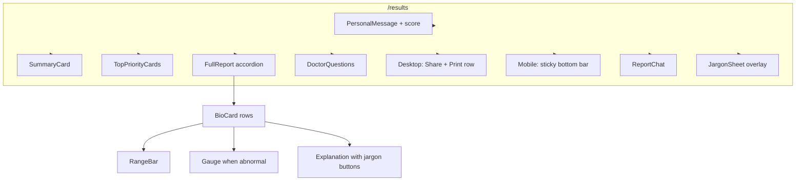

# Bodh — design system and UX architecture

This document matches the **implemented** frontend (`frontend/`). For system and API architecture, see [architecture.md](./architecture.md) and [PROJECT_IMPLEMENTATION.md](./PROJECT_IMPLEMENTATION.md).

---

## 1. Design philosophy

1. **Trust through typography** — Editorial serif for brand moments; neutral sans for reading; monospace for numbers so values feel auditable.
2. **Honest visualization** — Gauges and range bars use a shared mathematical scale so “a little high” and “very high” read differently on the track, not only in copy.
3. **Calm healthcare UX** — Severity uses color as triage signal; emergency uses **violet** (not only red) to reduce “red banner” fatigue while staying serious.
4. **Progressive disclosure** — Long reports collapse into expandable cards; jargon is optional tap-to-reveal.

---

## 2. Typography (as implemented)

| Role | Fonts | Where |
| :--- | :--- | :--- |
| **Body / UI** | **Inter**, with **Noto Sans Devanagari** as fallback for Hindi and Marathi | `app/globals.css` (`body`) |
| **Brand & display headings** | **Georgia**, serif | Navbar wordmark, landing hero and section titles, manual page title, analyze loader title, print shell headings |
| **Marketing band (landing)** | **Plus Jakarta Sans** | Wrapped band on `LandingPage` for a slightly more product-marketing feel |
| **Lab values & numeric emphasis** | **JetBrains Mono** | `globals.css` `.font-mono`; biomarker values in `BioCard` use JetBrains explicitly |
| **Print HTML** | Georgia titles; **Arial** body; **Courier New** for numeric cells | `app/print/page.tsx` inline print styles |

There is no separate fourth “clinical” font beyond JetBrains for data; Devanagari is handled via Noto alongside Inter.

---

## 3. Severity color system (source of truth: `lib/constants.ts`)

Colors drive badges, borders, page tint, gauge center segments, and range-band tints. **`UNKNOWN`** is a first-class tier for unverified ranges.

| Severity | Accent (main) | Typical use in UI |
| :--- | :--- | :--- |
| **NORMAL** | `#10B981` | Emerald badges, safe state |
| **WATCH** | `#D97706` | Amber family (UI copy says “watch”; hex is deep amber, not `#F59E0B`) |
| **ACT_NOW** | `#E11D48` | Rose/red urgency (close to Tailwind rose; not exactly `#EF4444`) |
| **EMERGENCY** | `#7C3AED` | Violet for critical — distinct from ACT_NOW red |
| **UNKNOWN** | `#94A3B8` | Slate — “needs clinician / unclear range” |

Each severity also defines **`bg`**, **`border`**, **`text`**, **`badge`**, **`headerGrad`**, **`pageTint`**, and parallel **`SEV_RANGE_VIS`** entries for the **RangeBar** center band and **Gauge** center arc colors (e.g. watch uses amber bar, not green).

**Primary brand / actions:** `#0D6B5E` (deep teal) — primary buttons, focus rings, links, language toggle active state, reading-progress bar on results, gradient paired with `#1A9E86` on navbar mark.

**App shell:** default page background `#FAFAFA`; results page background comes from `SEV[...].pageTint`.

**PWA theme** (`public/manifest.json`): `theme_color` `#1A6B5E` (aligned family, not identical to every in-app hex).

---

## 4. Data visualization

### Rule-of-thirds `RangeBar` and `Gauge`

Implemented in `components/RangeBar.tsx` and `components/Gauge.tsx`:

- `ext = high - low` (or `1` if zero width).
- Visual domain: **`[low - ext, high + ext]`** so the clinical normal band maps to the **middle third** of the bar (explicit `33.33%` width for the band).
- Pointer position is clamped (bar: 2–98%; gauge maps to a **180°** arc).
- **Motion:** Framer Motion **spring** on the range marker (`RangeBar`).

The **middle band color** follows **severity** via `SEV_RANGE_VIS` (e.g. WATCH shows an amber band, not always green), so the track communicates both “where normal sits” and “how serious this row is.”

---

## 5. Key UX patterns

### Analysis loading (`AnalyzeScannerLoader`)

While `useAnalyze` runs (`loading === true` on `/analyze`):

- **Stages** advance on a **client timer** (~2s per step, capped at stage 4) in parallel with the real API call — they are **perceived progress**, not guaranteed server phase alignment.
- Copy comes from **`STAGES`** in `lib/constants.ts` (e.g. decoding jargon, PII removal, ICMR verification, summary, translation) — localized EN / HI / MR via `t()`.
- **Visuals:** `ScanOrb` — rotating conic ring, SVG arc progress, pulsing inner disc, orbiting dots; **stage checklist** with check / pulse / pending states; **gradient progress bar**; **“While you wait”** tip carousel (`TIPS` per language).
- This is a **scanner-inspired, trust-building loader** (orb + timeline + tips), not a literal “laser sweep over a document silhouette” in code; if you demo that metaphor, describe it as experience design language aligned with this screen.

### Jargon sheet (progressive disclosure)

- **`JARGON`** map in `lib/constants.ts` — curated terms with **`en`** and **`hi`** strings (Marathi is not wired per-term in the sheet today; the sheet uses English copy for non-Hindi).
- **`BioCard`** splits explanation words; matches keys get a **dashed underline** in **brand teal** (`#0D6B5E`), `button` + `hover:bg-emerald-50`.
- **`JargonSheet`** — bottom sheet (`fixed inset-0`, sheet `translateY`), dimmed backdrop, drag handle, closes on backdrop tap. Footer line: “Source: ICMR Medical Terminology.”
- Parent state: **`FullReport`** and **`ResultsPage`** hold `jargon` and render `<JargonSheet />` when set.

### Mobile sticky action bar (`results/page.tsx`)

- **`md:hidden`** fixed bottom bar: `bg-white/95`, `backdrop-blur-sm`, border-top.
- Houses **reading score chip**, **WhatsApp share**, **Print** (print snapshots result to `localStorage` then opens `/print`).
- Desktop keeps **inline** share + print above the fold in the main column.
- **Top reading progress:** fixed `0.5` px bar, `bg-[#0D6B5E]`, width from scroll percentage.

### Floating report chat

- **`ReportChat`** — fixed bottom-right sheet on mobile (`fixed bottom-0 right-0`), card style on `md+` with border and shadow.
- Starters from API `chat_questions_*`; messages call **`/api/chat`** with report JSON + short history.

### Manual entry and analyze upload

- **`/manual`** — table-style entry, common quick-add chips, link from analyze page.
- **`AnalyzeUpload`** — Framer Motion layout, drag-drop, camera `capture`, trust row (“No data stored”, “PII removed”, etc.), elderly-aware typography where props pass through.

---

## 6. Language and “elderly” mode

### Language (zero full-page reload)

- **`AppProvider`** holds `lang`: **`en` | `hi` | `mr`**.
- **`Navbar`** segmented control (pill group): switches `setLang` — **client-side only**; strings are selected via helpers like `explanationFor` / `t()` / per-component copy objects.

### Elderly mode (large text)

- **Not auto-detected from demographics** — user toggles **`A+`** in the navbar (`elderly` / `setElderly` in `AppContext`).
- When on, multiple components increase font sizes and min heights (e.g. `BioCard`, `DoctorQuestions`, `ReportChat`, manual labels, results sticky actions).

---

## 7. Sharing (WhatsApp)

- **`shareWA`** on results builds a **single plain-text message** (with simple `*asterisk*` emphasis) and opens **`https://wa.me/?text=${encodeURIComponent(msg)}`**.
- There is **no `.txt` file attachment** — compatibility comes from **URL-encoded text** inside the WhatsApp deep link (works on low-end devices without generating PDFs). PDF phrasing in pitches should be corrected to this behavior.

---

## 8. Component hierarchy (results-oriented)

`BioCard` handles expand/collapse, severity accent rail, optional gauge, diet tip, and jargon triggers.

---

## 9. Accessibility and inclusivity (current state)

| Area | Implementation |
| :--- | :--- |
| **Languages** | EN / HI / MR without route reload |
| **Motion** | Framer Motion used widely; no dedicated `prefers-reduced-motion` branch yet — a reasonable future improvement |
| **Contrast** | Relies on Tailwind semantic pairings; severity text colors chosen for readability on tinted backgrounds |
| **Touch targets** | Elderly mode increases tap text; sticky bar uses full-width buttons on small screens |
| **Keyboard** | Drop zone supports Enter/Space to open file picker (`AnalyzeUpload`) |

---

## 10. Related files (for designers and devs)

| Concern | Files |
| :--- | :--- |
| Tokens / severity | `frontend/lib/constants.ts` |
| Types | `frontend/lib/types.ts` |
| Global fonts | `frontend/app/globals.css` |
| Shell / nav | `frontend/components/Navbar.tsx`, `AppShell.tsx` |
| Results layout | `frontend/app/results/page.tsx` |
| Loader | `frontend/components/AnalyzeScannerLoader.tsx`, `frontend/hooks/useAnalyze.ts` |
| Biomarker UI | `frontend/components/BioCard.tsx`, `RangeBar.tsx`, `Gauge.tsx`, `FullReport.tsx` |
| Jargon | `frontend/components/JargonSheet.tsx` |

---

## 11. Pitch vs code — quick honesty checklist

| Claim | Verdict |
| :--- | :--- |
| “Laser over document silhouette” | **Metaphor only** — actual UI is orb + staged list + tips (see §5). |
| “WhatsApp uses `.txt`” | **Inaccurate** — plain text via **`wa.me/?text=`** (§7). |
| “Elderly mode from demographics” | **Inaccurate** — manual **A+** toggle (§6). |
| “Jargon in Marathi in sheet” | **Partial** — glossary entries are **en/hi**; Marathi UI elsewhere. |
| “Middle third normal band” | **Accurate** (§4). |
| “Violet for emergency” | **Accurate** (§3). |

Use this table when tightening hackathon slides so judges get **engineered truth**, not aspirational drift.
